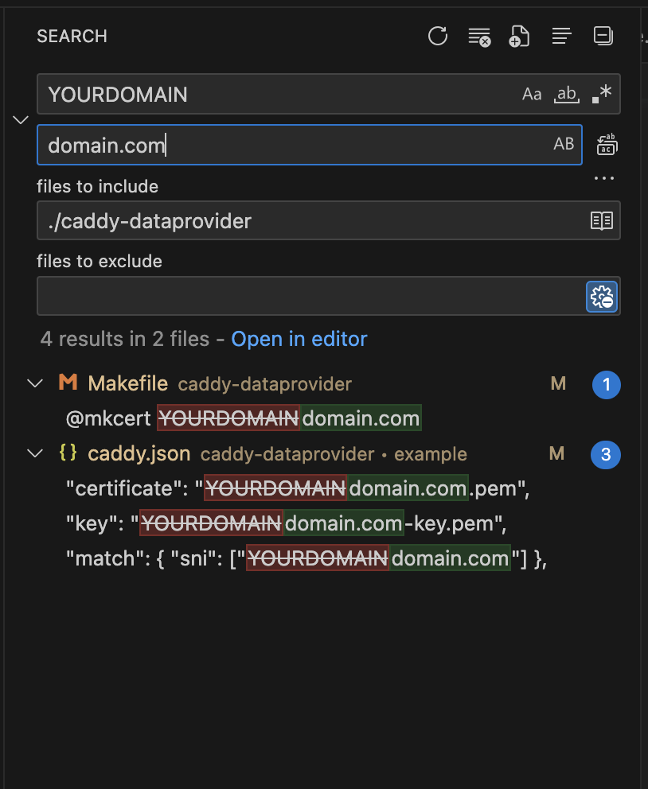

## Caddy Data Provider

Caddy Data Provider will help nodeJS server to fetch initial data load using concurrancy in golang. It is increase more than 100% on the server load.

### How To Start

1. Install xcaddy by follow step https://github.com/caddyserver/xcaddy#install
2. Install mkcert by follow step https://github.com/FiloSottile/mkcert#installation
3. Replace PLACEHOLDER domain config with your real domain. Example below

4. Currently middleware only support for Arael path `/blog`, `YOU KNOW WHAT I MEAN`. Run Arael locally and make sure port 3000 and 3001 running properly.
5. Execute command `make generate-ssl` to generating SSL for your local domain
6. Execute command `make run-module` to running web edge
7. Open your domain using HTTPS, e.g: `https://domain.com`